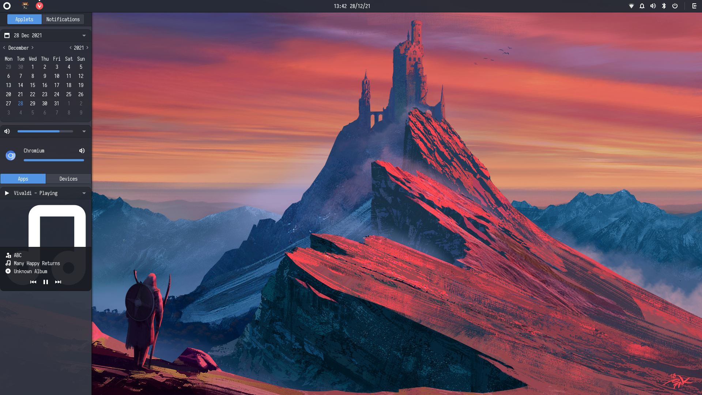

<h1 align=center>Dotfiles</h1>

<h2 align=center>🐧 One Dark - Budgie - Arch</h2>

# 
# 

# Prerequisites
ColorLS - https://github.com/ksxrubyapps/colorls

Neofetch - https://github.com/dylanaraps/neofetch

Kitty - https://github.com/kovidgoyal/kitty

Vis - https://github.com/dpayne/cli-visualizer

Zsh - https://github.com/zsh-users/zsh

Zsh Syntax Highlighting - https://github.com/zsh-users/zsh-syntax-highlighting

Zsh Autosuggestions - https://github.com/zsh-users/zsh-autosuggestions

Mutter Rounded - https://github.com/yilozt/mutter-rounded
